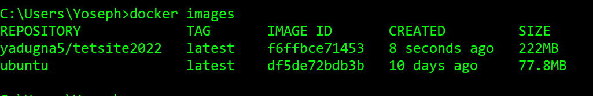

# Kubernetes-Containerization
### By Yoseph A. Kassaye

#### Required Tools:
1. Code Editor
2. Azure CLI
3. Command line editor

### Container Basic :Pull image manually and run the container 
1.	docker pull ubuntu => to pull images
2.	docker images => cehck if the image si pulled
3.	docker run -d -it -p sourcePort: targetPort ImageId

4.	docker ps 
## Here the server is there, but we do not have Web Server - Folllow the steps below
5.	docker exec -it  containerId bash
6.	apt-get update
7.	apt-get install apache2 -y
8.	service apache2 status
9.	service apache2 start
10.	Exit from bash
### check if the default page from your local host is working:
 http://localhost:sourceportnumber (given on number 3)

If you stop the running container now, everything you have will be gone- so make sure to commit 

11.	docker commit containerId username/tagName
if you go to the image list, you will see two mages listedout. 
 
### Now run the commited image (with other changes) 
12.	docker run -d -it -p sourceport:Target ImageId
13.	docker exec -it  containerId bash
14.	service apache2 status
15.	service apache2 start
   Try again  http://localhost:sourceport (given on number 12)
16. docker push userName/tagName
#### Here everything is manual and it will be hard to do this manually, but there are other opons we can do decleratively as:

Steps:
1. Create a file called Docerfile as:
   ~~~ 
    FROM ubuntu
    COPY . /var/www/html             
    RUN apt-get update
    RUN apt-get install -y apache2 && apt-get clean
    EXPOSE 80
    CMD apachectl -D FOREGROUND
    ~~~
2. Create one sample html page and add some contents
3. docker build -t yadugna5/yayobegsite2022 .
4. NOw you can run the image and create a container 
5. ONce you test, you can push your container to container repository as:
   docker push username/containername
6. you can now remove container and images form your local and get the image from the remote image repository 

#### Create AKS (Azure Kubernete Service) and and run the images in it (inside pod(s)) 
1. 	Create Kubernetes Cluster
	Basics
* Subscription: Free Trial
* Resource Group: Creat New: aks-rg1
* Kubernetes Cluster Name: aksdemo1
* Region: (US) Central US
* Kubernetes Version: Select what ever is latest stable version
* Node Size: Standard DS2 v2 (Default one)
* Node Count: 1
* 	Node Pools
* 	leave to defaults
	Authentication
* 	Authentication method: System-assigned managed identity
* 	Rest all leave to defaults	Networking
* 	Network Configuration: Advanced
* 	Network Policy: Azure
* 	Rest all leave to defaults
	Integrations
* 	Azure Container Registry: None
* 	leave to defaults
* 	Tags
* 	leave to defaults
* 	Review + Create
* 	Click on Create

   #### Install Azure CLI and access  it
Perform the following steps
1. Create two files (one for Deployment nd one for Srevice)
   #### Deployment
   ~~~
   apiVersion: apps/v1
    kind: Deployment
    metadata:
    name: myapp1-deployment
    namespace: yayobe
    spec:
    replicas: 2
    selector:
        matchLabels:
        app: myapp1
    template: 
        metadata: # Dictionary
        name: myapp1-pod
        labels: # Dictionary 
            app: myapp1       
        spec:
        containers: # List
            - name: myapp1-container
            image: yadugna5/yayobegsite2022
            ports:
                - containerPort: 80

### Service
    
        apiVersion: v1
        kind: Service
        metadata:
        name: myapp1-loadbalancer
        labels: 
            app: myapp1
        spec:
        type: LoadBalancer 
        selector:
            app: myapp1
        ports: 
            - port: 80
            targetPort: 80
2. Get Credential as:
   ~~~
    az aks get-credentials --resource-group <Resource-Group-Name> --name <Cluster-Name> 
3. Publish deployment into AKS
   ~~~
   kubectl apply -f demo-manifestfile/.
4. Check if pods are created:
   ~~~
   kubectl get pods
5. check if services are created
   ~~~ 
   kubectl get svc
6. Get loadbalacing External IP and try if the application works

## Docker Volume
If you want to update the running container to be mapped with the local volume, you can do as follows:
~~~
docker run --rm -it --name admin -p lp:containerport -v projectpath:/src 01a2b9cdcaf7
Example: docker run --rm -it --name admin -p 3002:3000 -v C:\Users\Yoseph\Dropbox\_Project\_2021Yyaobe\2022\Debelo\debelo\debelo\admin:/src 01a2b9cdcaf7
~~~
## React APP Dockerfile
~~~
FROM node:16.16.0-buster

WORKDIR /src

COPY  package.json package.json
COPY  package-lock.json package-lock.json

RUN npm install

COPY . .

CMD ["npm", "run", "start"]
~~~
## Multi Stage Image
This is to minimize the size of the file

~~~
FROM node:16.16.0-buster as build

WORKDIR /src

COPY  package.json package.json
COPY  package-lock.json package-lock.json

RUN npm install

COPY . .

RUN npm run build

FROM nginx:1.10-alpine as prod

COPY --from=build /src/build /usr/share/nginx/html

EXPOSE 80

CMD ["nginx", "-g", "daemon off;"]
~~~
Now you can run the container as:
~~~
docker run -it --rm -p 3033:80 ID
